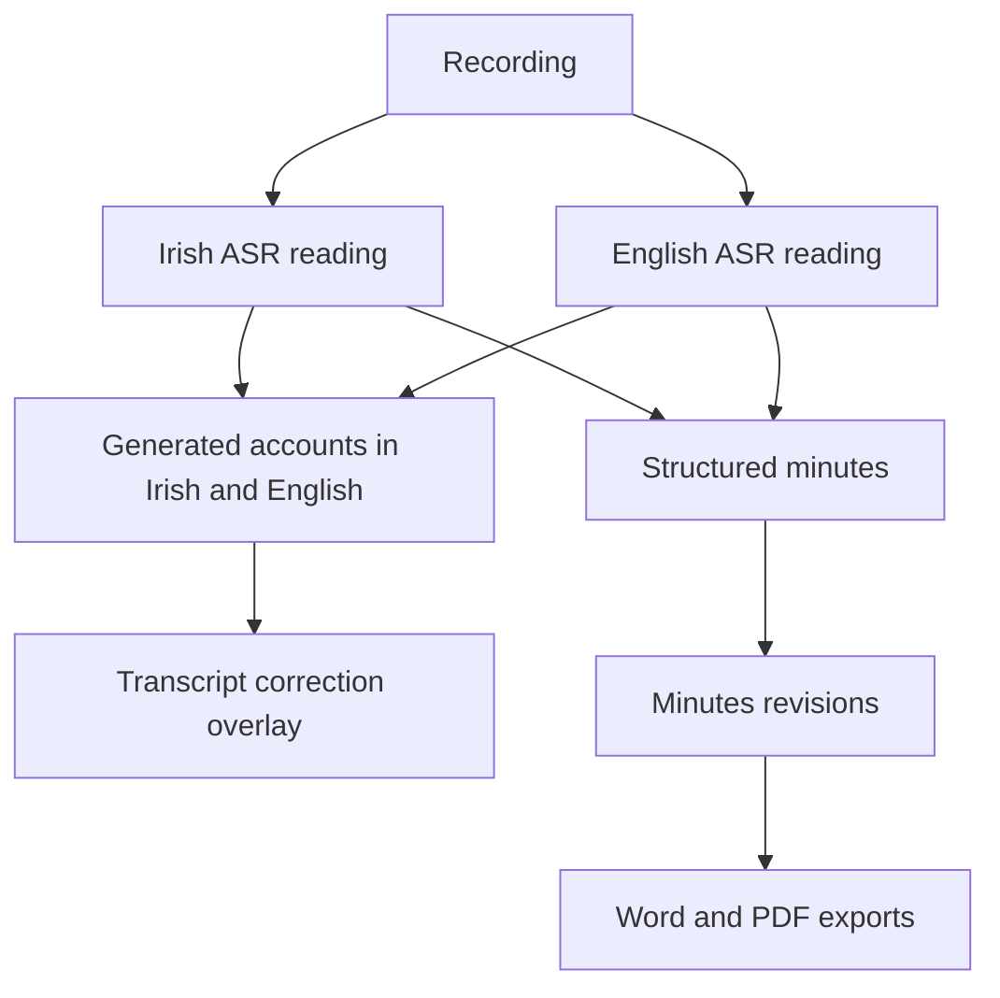

# Dialext: personal-product architecture review

Review date: 15 September 2026. This is an assessment and a proposed reset for discussion, not an implementation plan already approved. The current user direction is to build a useful personal tool and set aside organisational deployment. Older commercial ambitions are context, not the objective of this review.

**The project is recoverable. Its main problem is that the interface, the data model and the development rules describe different products.** There are working foundations, incomplete interactions, historical data damage and unresolved speech-quality questions. Treating all four as one broken backend would encourage an unnecessarily destructive rewrite.

I inspected the current working tree, recent history, product documents, server routes, worker orchestration, transcript/minutes projections and the supplied Claude Design export at `/Users/joshuacorbett/Downloads/Dialext UI mockups/Dialext Web App.dc.html`. I opened both the design and the real app in a browser. The app preview used an isolated synthetic fixture, the real server/routes and an in-memory database; it did not run transcription providers or modify existing recordings.

`npm test` reported 1,028 tests: 1,027 passed, zero failed, one skipped. The skipped test is the Azure object-store emulator tier. `npm run check` completed successfully. Browser inspection confirmed that opening a record, switching transcript language surfaces and saving a reconstructed line are connected to real routes. The saved line reappeared after a browser reload. This does not prove persistence across a server restart, real-audio playback, successful fresh transcription, reconstruction accuracy or the integrity of the existing development database and files. Those were not established in this review.

The checkout already contained 38 modified tracked files and seven untracked paths, including changes to ASR confidence, search, editing and download checks. The assessment includes those changes. A rollback to HEAD would therefore discard substantial work rather than restore a known working product. No application code was changed during this review.

**What the original design actually asks for**

The mockup is a compact meeting library and reading workspace. Its summary has Overview, Decisions and Actions; its tabs are Summary, Notes, Transcript and Downloads. It shows named voices, marked phrases, a review panel beneath a passage, a persistent audio player and three useful exports: minutes as DOCX, transcript as TXT and original audio.

It also contains illustrative behaviour. Its language-switch function changes button styling without replacing the transcript text; its download links point to `#`; the suggested readings and percentages are hard-coded; its processing button changes screens without doing work. The export is a valid visual and interaction reference, but it is not an implemented frontend that could be made complete by substituting API URLs.

That distinction should have led to an explicit feature-to-data contract. Instead, much of the design was translated into whatever the backend already allowed, while other parts became neutral placeholders or disappeared.

| Intended experience | Current implementation | What kind of mismatch this is |
| --- | --- | --- |
| Compact Overview, Decisions, Actions | Summary renderer also exposes attendance, discussion themes and open questions when appropriate; editing follows structured-record paths | Product and presentation choices, not a reason to redesign the database |
| Summary, Notes, Transcript, Downloads | Summary, Transcript, Speakers, Downloads, My notes | Explicit navigation change; should be your decision |
| Download minutes, transcript and original audio | The client offers DOCX and PDF minutes only | Missing export capabilities, not missing styling |
| Named speakers in the reading | Speaker names are in-memory overlays; the panel says they do not persist or enter exports | Missing persistence and a recording-wide identity contract |
| Click a phrase, inspect alternatives, correct it | Raw-reading correction controls exist; reconstructed accounts offer whole-line editing; the suggestion renderer has no real alternatives source | The screen and engine operate at different levels of detail |
| A few useful uncertainty marks | An earlier adapter bug stored null confidence; the fix carries phrase confidence onto words; the threshold remains uncalibrated; leg-divergence code is not wired in | Input-contract and evaluation work, not an underline CSS issue |
| Duration, file size, ETA and waveform | Several values are absent or decorative because their data is not supplied | Some ordinary metadata work; ETA and probability claims need actual measurement |
| A Share action | Removed from the current app; the design export itself has no functioning share operation | Meaning needs defining: copy/export, OS sharing or a hosted link are different features |
| Simple New recording flow | Current visible flow is file upload with organisational classification and rights controls | Old deployment policy dominates personal use; microphone capture is not offered by this form |

The summary screenshot also shows a spacing mismatch: plain paragraph elements inside list items retain spacing that makes a short record substantially less compact than the mockup. Preserving element IDs did not preserve the design's composition. Element-contract tests can catch missing nodes, but cannot certify the result looks or feels right.

**The deeper mismatch is the meaning of “the transcript”.**

The source recording produces two immutable ASR readings. Both readings are then used independently by two branches:

There is currently no correction-to-minutes regeneration path. The account that you read and correct is deliberately outside the minutes-generation evidence path. The reconstruction request supplies transcript text and anchors, not the recording's audio. Valid anchors establish where to inspect an output; they do not establish that its wording or interpretation is correct.

The reconstruction prompt explicitly asks for all text in a target language, regardless of the language spoken. Your mockup displays Irish and English speech together. Its language switch is only illustrative, so it does not settle whether you wanted an original-language transcript, translated versions, or both. That is a central engine decision, not a cosmetic selector choice.

There is also a concrete search mismatch: `listJobSummaries` in `pipeline/repositories/jobs.mjs` searches source-reading text and selected minutes fields, but not reconstructed accounts or transcript corrections. A word visible only in a corrected account can therefore be absent from the recordings-library search. This follows from code inspection; it was not separately exercised in the browser.

**Why the work drifted**

The README still describes an operator-run delivery service and an R&D app that has been deleted. The product vision describes an organisational meeting assistant. AGENTS.md begins with a summary-led workflow but later calls the core experience transcript-first. It simultaneously contains old “no route, no UI” statements and later entries saying those slices are shipped. It is over 1,200 lines long and mixes product authority, incident history, implementation notes and deployment restrictions.

Those instructions also treat several choices as permanent: platform identity, a planned Postgres migration and a tightly governed delivery workflow. Your new scope explicitly reopens that direction. Future development needs a short current brief, with old decisions labelled historical, or agents will keep restoring the previous product while believing they are following instructions.

The tests provide useful protection for individual contracts. However, the client DOM suite substitutes fetch responses, and the smoke script starts the public website rather than walking through the actual recording workspace. It also clones committed state, omitting the current uncommitted work. This leaves a gap between “the modules agree with their fixtures” and “the person can complete the task on screen”.

There was real damage as well as drift. The August incident report records missing artefact bytes, stale storage paths, a stale worker running old code, and test cleanup deleting source audio. It records repairs and moving development roots outside the repository. Those are historical findings, not proof of present corruption. Existing data should be checked through its ledger and storage adapter before migrations or cleanup; it should not be deleted to make tests green.

**A smaller architecture worth considering**

My recommendation is a personal application running on your Mac: one browser interface, one local API, one background worker, SQLite and local files. One launcher should manage both processes and report whether they are healthy. The existing `product:dev` runner already supplies part of that shape. Keeping processing outside HTTP requests still has value for long jobs, cancellation, restarts and paid-call reuse; it does not require separate cloud deployments.

Keep the ASR adapters, immutable source readings, timestamp links, repository layer, useful validation and worker recovery machinery initially. Existing organisation columns can hold one workspace; deleting tenancy from every table would create migration work without improving your immediate experience. Park the public site, enterprise identity rollout, Postgres migration, sales/delivery machinery and organisational integrations outside the active personal-product scope. This is a proposed target, not a change to the current security or processing settings.

Make one recording workspace the consumer-facing contract. It should consistently supply the readable transcript, names, notes, output versions, audio and available actions. Transcript rendering, search and transcript export should use the same effective reading, including saved corrections. Minutes should record which inputs they were generated from. Updating minutes from corrections should be an explicit operation with a preview, preserving earlier versions; it must not silently overwrite manual edits or relabel generated prose as raw evidence.

Build two ways to exercise that same application: a clearly labelled sample mode using the real local API/database/worker and deterministic provider fixtures, and a live mode using configured services. Sample mode should cover errors, retry, editing, audio, export and reload as well as the happy path. The expired Azure credential should block new live transcription, not development of the interface or inspection of stored results. “Personal and local” describes where the app and data live; entirely offline speech recognition would be a separate requirement.

**The next work should be a complete user journey.**

First preserve the current work and existing data, choose the canonical mockup and replace contradictory active instructions with a short brief. Then establish a repeatable sample recording that passes through the real app to a usable output. Restore the agreed screen composition and complete each chosen interaction through storage and export. Verify it by using the browser, refreshing and restarting the app. Only then use a short, explicitly chosen live recording to assess provider behaviour and bilingual quality.

Do not count a button as complete because it renders, or a backend feature as complete because its CLI works. The useful acceptance test is: open the app, get a result, correct it, save it, reopen it and obtain the intended file without visiting the terminal to repair the job.

**Decisions for you**

1. Describe the smallest successful session: what recording do you put in, and what result makes the tool worth keeping? Is the essential output a faithful bilingual transcript, useful meeting notes, or both?
2. Should the main transcript preserve Irish and English exactly where they were spoken, with translations as separate views, or should each view be entirely in one chosen language?
3. Which mockup interactions are essential to that session—phrase correction, suggested alternatives, persistent speaker names, personal notes, sharing, transcript export or direct recording? Their visual placement can be preserved while their implementation is scoped explicitly.

You do not need to choose a cloud platform or frontend framework to answer those questions. They determine what the existing engine must produce and which parts of the interface deserve to be completed first.

Evidence locations: `docs/product-vision.md`; `AGENTS.md`; `README.md`; `docs/incidents/2026-08-15-confidence-probe.md`; `scripts/development-product.mjs`; `scripts/smoke.mjs`; `web-app/client/index.html`; `web-app/client/app.mjs`; `web-app/client/app.dom.test.mjs`; `web-app/client/transcript.mjs`; `web-app/server/app.mjs`; `pipeline/worker/step.mjs`; `pipeline/process.mjs`; `pipeline/transcript/reconstruct.mjs`; `config/reconstruction-system-prompt.txt`; `pipeline/repositories/jobs.mjs`. Test logs from this review are in `/tmp/dialext-architecture-review-20260914-tests.log` and `/tmp/dialext-architecture-review-20260914-check.log`.
